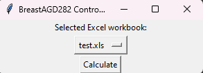
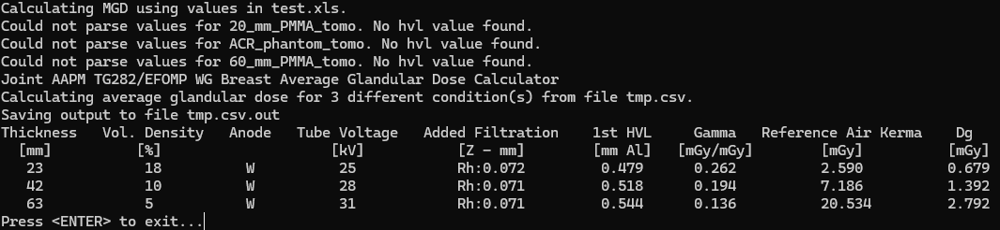

# TG282ExcelAdaptor

## Description

TG282ExcelAdaptor is a Python-based tool designed to streamline the process of extracting dosimetry data from mammo testing Excel spreadsheets and preparing it for analysis with the BreastAGD282 dosimetry software. This tool automates the data extraction, formatting, and conversion processes to easily calculate average glandular dose using the AAPM TG282/EFOMP method.

## Installation

Requires Python 3.11 or greater. To set up TG282ExcelAdaptor, follow these steps:

1. Clone the git repository:
   ```
   git clone https://github.com/dhen2714/TG282ExcelAdaptor.git
   cd TG282ExcelAdaptor
   ```

2. Download the TG282 dosimetry software:
   - Visit https://zenodo.org/records/10215098
   - Download the software package
   - Unzip the executable and 'data' folder into the cloned repository

3. Set up a Python virtual environment (recommended):
   ```
   python -m venv venv
   source venv/bin/activate  # On Windows, use `venv\Scripts\activate`
   ```

4. Install xlwings:
   ```
   pip install xlwings

5. (Optional) Create an executable:
   To create a standalone executable, PyInstaller can be used. First, install PyInstaller:
   ```
   pip install pyinstaller
   ```
   Then, create the executable:
   ```
   pyinstaller --onefile main.py
   ```
   This will create a `dist` folder containing the executable. Note that the BreastAGD282 executable and 'data' folder still must be in the same directory as this executable.

## Usage

The Mammography Data Processor uses a TOML configuration file to determine which conditions to use for dosimetry calculations and which spreadsheet cell addresses to scrape. Follow these steps to use the software:

1. Ensure you have a mammography testing spreadsheet open in Excel.

2. Make sure your `mammo_template.toml` file is correctly configured with the appropriate cell addresses and conditions.

3. Run the data processing software by executing:
   ```
   python main.py
   ```

4. The BreastAGD282 Controller window will appear. Select your Excel workbook (e.g., "test.xls") and click "Calculate".

   

5. The software will process the data and output the results to the command window. You should see something similar to this:

   

   The output includes:
   - Calculation status for different phantom types
   - Joint AAPM TG282/EFOMP WG Breast Average Glandular Dose Calculator information
   - A table with columns for Thickness, Vol. Density, Anode, Tube Voltage, Added Filtration, 1st HVL, Gamma, Reference Air Kerma, and Dg

6. The results will also be saved to a file named `tmp.csv.out` in your working directory.

7. Press <ENTER> to exit the program when you're done reviewing the results.

Note: If you encounter any "Could not parse values" messages, check your Excel spreadsheet to ensure all required values are present, particularly the HVL (Half-Value Layer) values for each phantom type.